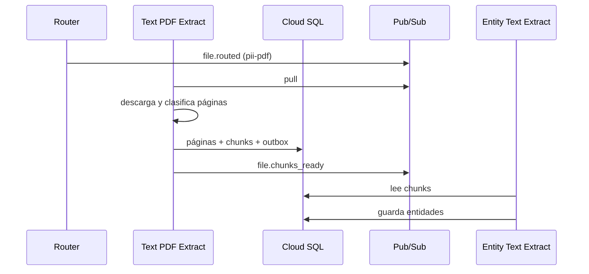

# Flujo por tipo de archivo

El Router decide la ruta usando MIME type, extensión y tipo nativo de Google
Drive. La tabla refleja el comportamiento actual, no una arquitectura futura.

| Entrada | Topic | Consumidor actual | Resultado |
|---|---|---|---|
| PDF | `pii-pdf` | Text PDF Extract | Chunks si el texto es embebido; poison si requiere OCR |
| TXT | `pii-docs` | Text Docs Extract | Texto decodificado y dividido en chunks |
| DOCX | `pii-docs` | Text Docs Extract | Párrafos y tablas en orden documental |
| Google Docs | `pii-docs` | Text Docs Extract | Exportación a `text/plain` y chunks |
| Google Slides | `pii-docs` | Text Docs Extract | Exportación a `text/plain` y chunks |
| Imagen | `pii-ocr` | Ninguno | El helper crea una suscripción temporal, pero no hay OCR cloud |
| CSV, XLSX, XLSM, Google Sheets | `pii-tables` | Ninguno | Se publica; sin una suscripción propia no queda retenido |
| XLS, DOC o tipo desconocido | `pii-unsupported` | Ninguno | Se publica; sin una suscripción propia no queda retenido |

## PDF con texto embebido

El extractor usa PyMuPDF y reglas deterministas para decidir si una página
tiene texto suficiente o parece dominada por imágenes. No usa un modelo de ML
para esta decisión.

## PDF que requiere OCR

La política cloud actual es `OCR_POLICY_POISON`: si cualquier página requiere
OCR, se rechaza el PDF completo, se eliminan sus chunks y se publica
`file.text_extract_poisoned` con razón `ocr_required`. El cliente MinerU copiado
en `Text_Extract/ocr` no está conectado a un Cloud Run Job en este pipeline.

## Documentos de texto

- TXT: intenta UTF-8 con BOM y luego Latin-1.
- DOCX: preserva el orden relativo de párrafos y tablas.
- Google Docs/Slides: Drive exporta el recurso a texto plano.

Los documentos se representan como una página lógica. Un documento vacío
termina correctamente con cero chunks.

## Fuentes tabulares

Hay dos casos distintos:

1. Los archivos CSV/Excel/Sheets descubiertos en Drive se publican en
   `pii-tables`, pero hoy no existe consumidor cloud.
2. El BBDD Job sí analiza tablas, pero se conecta directamente a PostgreSQL u
   Oracle y no recibe archivos ni mensajes del Router.
