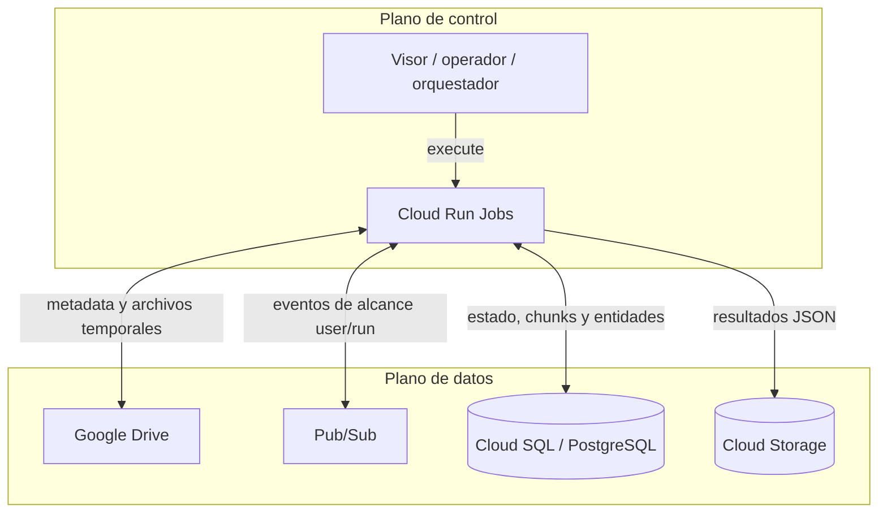

# Visión general

## Responsabilidades

La solución separa el descubrimiento, la extracción de texto y la detección de
PII. Cloud SQL conserva el estado durable del pipeline; Pub/Sub desacopla las
etapas; GCS almacena artefactos JSON finales. Los archivos de las fuentes externas se
materializan de manera temporal dentro de cada job y no viajan por Pub/Sub.

## Secuencia del pipeline de archivos

1. **File Discovery + Router** enumera recursivamente una carpeta de la fuente externa, compara el inventario con ejecuciones anteriores y decide la ruta de
   cada archivo.
2. **Text PDF Extract** y **Text Docs Extract** consumen sus suscripciones por
   `user_id` y `run_id`, materializan el archivo, extraen texto y escriben
   páginas y chunks en Cloud SQL.
3. Cada extractor publica `file.chunks_ready`; el cuerpo del texto no se
   publica.
4. **Entity Text Extract** lee los chunks desde Cloud SQL, ejecuta detectores y
   filtros, persiste entidades aceptadas y sube los JSON configurados a GCS.
5. Los resultados se consultan desde Cloud SQL/GCS. El Visor puede presentar
   esos resultados, pero no forma parte del runtime cloud.

## Aislamiento por ejecución

Las suscripciones se crean para un par `user_id`/`run_id`. Los jobs validan que
el evento corresponda al alcance esperado antes de procesarlo. Esto evita que
una ejecución drene mensajes de otro usuario o run, siempre que las
suscripciones y variables `EXPECTED_USER_ID`/`EXPECTED_RUN_ID` se configuren de
forma coherente.

## Estado durable e idempotencia

- El Router registra ejecuciones, archivos, decisiones de ruteo y un outbox.
- Los extractores guardan el resultado y el evento pendiente dentro de una
  transacción antes de publicar.
- Entity reemplaza las entidades previas del mismo `file_id` al reprocesar.
- Los mensajes se confirman sólo después de completar el trabajo esperado por
  cada consumidor.

La idempotencia reduce duplicados, pero no sustituye la observabilidad: un
fallo entre Cloud SQL, Pub/Sub y GCS puede requerir reejecución o conciliación.

## Flujo BBDD

El BBDD Job se ejecuta aparte. Recibe una conexión PostgreSQL u Oracle, hace
introspección y muestreo, descubre posibles columnas con PII y proyecta los
hallazgos hacia la base de resultados. No depende del Router ni consume
`pii-tables`.
