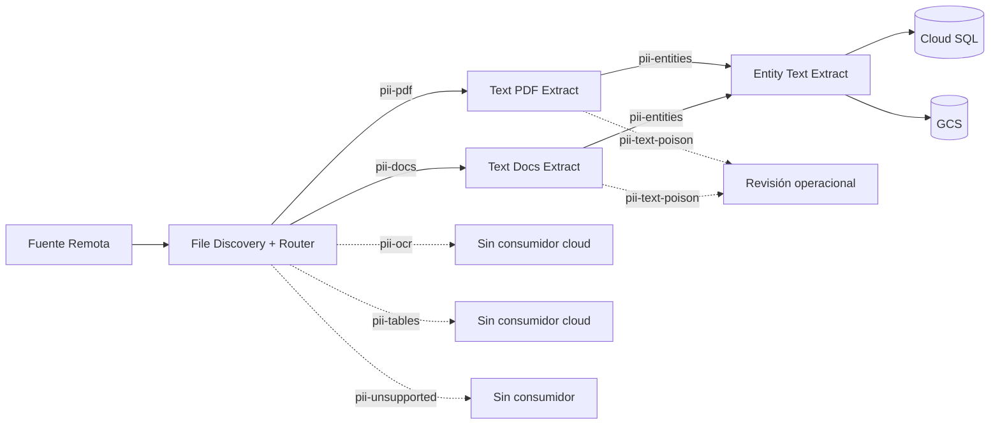

# PII-disocvery-Cloud-LdD

Esta documentación describe cómo se descubren los archivos, cómo se enrutan, qué hace cada Cloud Run Job, dónde quedan sus resultados y qué modelos de Machine Learning participan.

## Pipeline de archivos implementado

## Jobs

| Job | Entrada | Resultado principal |
|---|---|---|
| [File Discovery + Router](jobs/file-discovery-router.md) | Solicitud JSON y conexión fuente remota | Inventario en Cloud SQL y eventos `file.routed` |
| [Text PDF Extract](jobs/text-pdf-extract.md) | PDF enrutado | Páginas y chunks en Cloud SQL |
| [Text Docs Extract](jobs/text-docs-extract.md) | TXT, DOCX, Google Docs o Slides | Página lógica y chunks en Cloud SQL |
| [Entity Text Extract](jobs/entity-text-extract.md) | Evento `file.chunks_ready` | Entidades en Cloud SQL y JSON en GCS |
| [BBDD](jobs/bbdd.md) | Solicitud de escaneo y conexión de origen | Hallazgos tabulares en Cloud SQL y JSON en GCS |

## Cómo leer estas guías

- [Visión general](arquitectura/vision-general.md): componentes, fronteras y
  secuencia completa.
- [Flujo por tipo de archivo](arquitectura/flujo-por-tipo-de-archivo.md): qué
  camino sigue cada formato.
- [Modelos y licencias](ml/modelos-y-licencias.md): modelos activos, modelos
  opcionales, versiones y obligaciones a revisar.
- [Build, deploy y ejecución](operacion/build-deploy-ejecucion.md): orden
  operacional y puntos de verificación.
- [Docs as code](operacion/docs-as-code.md): cómo mantener este sitio junto al
  código.
