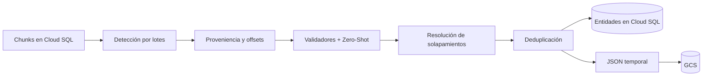

# Entity Text Extract Job

Nombre por defecto: `entity-text-extract-job`.

## Objetivo

Leer chunks listos desde Cloud SQL, detectar candidatos de PII con varias
familias de detectores, resolver solapamientos y falsos positivos, y persistir
el resultado consultable. Es la etapa terminal del pipeline de archivos que hoy
está implementado.

## Entrada

Consume `file.chunks_ready`, esquema `2.0`, desde una suscripción del topic
`pii-entities`. El mensaje identifica el archivo y la run; el texto se obtiene
de `text_chunks_staging`.

## Procesamiento

1. Valida evento y alcance.
2. Carga todos los chunks `ready` del archivo.
3. Ejecuta detectores deterministas, Presidio/spaCy, GLiNER2 y NER médico,
   según las variables de habilitación.
4. Conserva proveniencia de chunk, página y offsets.
5. Canonicaliza tipos, aplica validadores, usa Zero-Shot donde corresponde,
   resuelve solapamientos y elimina duplicados.
6. Reemplaza las entidades previas del `file_id` y guarda las aceptadas.
7. Genera localmente JSON filtrado y raw. Siempre sube el filtrado; el upload
   raw depende de `PII_ENTITY_SAVE_RAW_RESULTS`. Después actualiza las rutas.

## Modelos utilizados

| Componente | Uso |
|---|---|
| `es_core_news_lg` | NER español dentro de spaCy/Presidio |
| `fastino/gliner2-privacy-filter-PII-multi` | NER flexible orientado a PII |
| `HUMADEX/spanish_medical_ner` | Entidades médicas en español |
| Artefacto GCS esperado: `MoritzLaurer/mDeBERTa-v3-base-xnli-multilingual-nli-2mil7` | Clasificación Zero-Shot; la identidad de los bytes desplegados debe verificarse en el bucket |

Además hay regex y listas deterministas; no toda entidad proviene de ML. Las
licencias y riesgos de reproducibilidad se detallan en
[Modelos y licencias](../ml/modelos-y-licencias.md).

## Persistencia y artefactos

- `entity_extraction_files`: estado, tiempos y rutas de artefactos.
- `entity_extraction_entities`: entidades aceptadas con proveniencia.
- GCS: JSON filtrado y JSON raw cuando
  `PII_ENTITY_SAVE_RAW_RESULTS=true`.

No publica un evento downstream. El job termina después de Cloud SQL y GCS.

## Idempotencia y fallos

El reproceso por `file_id` elimina y reemplaza entidades anteriores. Un error
de detector, timeout, GCS o base propaga la excepción y evita el `ack`.
Contrato o alcance inválido se registra y retorna sin procesar; al volver al
loop el mensaje queda confirmado.

Cloud SQL se actualiza antes de completar la publicación en GCS. Si el upload
falla, puede existir transitoriamente una fila `completed` con rutas locales de
`/tmp`; la reentrega debe reconciliarla. La plantilla usa `maxRetries: 0`, por
lo que esa reentrega requiere una nueva ejecución.

## Variables esenciales

`SUBSCRIPTION_ID`, `DATABASE_URL`, `EXPECTED_USER_ID`, `EXPECTED_RUN_ID`,
`PII_ENTITY_GCS_OUTPUT_URI`, `PII_ENTITY_SAVE_RAW_RESULTS`,
`PII_ENTITY_ZERO_SHOT_MODEL_URI`, `PII_ENTITY_ZERO_SHOT_LOCAL_DIR`,
`PII_ENTITY_MODEL_DEVICE`, `PII_ENTITY_MODEL_BATCH_SIZE`,
`PII_ENTITY_ZERO_SHOT_BATCH_SIZE`, `PER_FILE_TIMEOUT_SECONDS`,
`PUBSUB_IDLE_TIMEOUT_SECONDS` y `MAX_MESSAGES`.

## Código fuente

- `Cloud/Entity-Text-Extract-Job/src/cloud_entity_text_extract_job/`
- `Entity_Text_Extract/`
- `Entity_Text_Filter/`
- `Cloud/Database/schema.sql`
