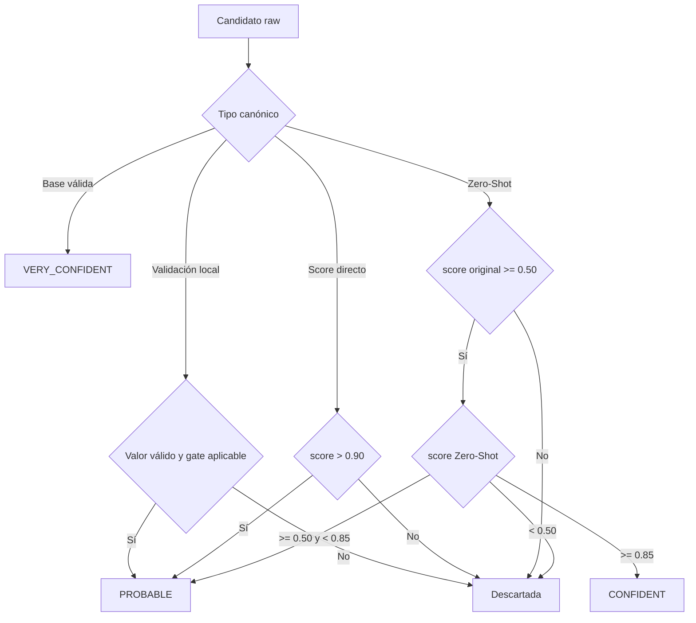

# Confianza y filtrado de entidades

El filtro de Entity asigna uno de tres niveles a cada entidad aceptada:
`VERY_CONFIDENT`, `CONFIDENT` o `PROBABLE`. No existe un nivel `UNRELIABLE` en
la salida filtrada: un candidato que no supera su ruta de validación se descarta
y no aparece en `accepted_entities` ni en `entity_extraction_entities`.



## Niveles actuales

| Nivel | Regla | `decision_method` | `decision_score` |
|---|---|---|---|
| `VERY_CONFIDENT` | Entidad base que supera su validador determinista | `base_validation` | `1.0` |
| `CONFIDENT` | Resultado Zero-Shot `>= 0.85` | `zero_shot` | Score Zero-Shot |
| `PROBABLE` | Zero-Shot `>= 0.50` y `< 0.85` | `zero_shot` | Score Zero-Shot |
| `PROBABLE` | Validación local superada | `local_validation` | Score original del detector |
| `PROBABLE` | Tipo gobernado por score con score original `> 0.90` | `model_score_threshold` | Score original del detector |

Los bordes son intencionales:

- `0.50` exacto entra al Zero-Shot y un resultado Zero-Shot `0.50` es
  `PROBABLE`.
- `0.85` exacto es `CONFIDENT`.
- Para las rutas gobernadas por `MODEL_SCORE_PROBABLE_THRESHOLD`, `0.90` exacto
  se descarta; debe ser estrictamente mayor que `0.90`.

## Rutas por tipo de entidad

| Ruta | Tipos canónicos | Resultado |
|---|---|---|
| Base determinista | `RUT`, `PHONE`, `EMAIL`, `PAYMENT_CARD`, `LICENSE_PLATE`, `PENSION_SYSTEM`, `HEALTH_SYSTEM`, `GENDER`, `MARITAL_STATUS`, `RELIGION_OR_BELIEF`, `SEXUAL_ORIENTATION`, `POLITICAL_OR_UNION_AFFILIATION` | `VERY_CONFIDENT` si el valor normaliza y valida; de lo contrario se descarta |
| Validación local | `AGE`, `DATE`, `IP_ADDRESS`, `MAC_ADDRESS`, `URL` | `PROBABLE` si valida. `IP_ADDRESS`, `MAC_ADDRESS` y `URL` además exigen score original `> 0.90` |
| Score original | `DOCUMENT_ID`, `CARD_EXPIRY`, `CARD_CVV`, `BANK_ACCOUNT`, `CRYPTO_WALLET`, `ACCOUNT_ID`, `USERNAME`, `PASSWORD`, `SECRET`, `API_KEY`, `ACCESS_TOKEN`, `RECOVERY_CODE`, `BIOMETRIC_OR_BIOLOGICAL` | `PROBABLE` sólo con score original `> 0.90` |
| Zero-Shot | `NAME`, `ORGANIZATION`, `LOCATION`, `ADDRESS`, `MEDICAL_PROBLEM`, `MEDICAL_TEST`, `MEDICAL_TREATMENT` | Gate original `>= 0.50`; después `CONFIDENT`, `PROBABLE` o descarte según score Zero-Shot |

## Parámetros de la política

| Parámetro | Valor actual | Efecto | Configurable por entorno |
|---|---:|---|---|
| `ZERO_SHOT_MIN_MODEL_SCORE_THRESHOLD` | `0.50` | Gate sobre el score original antes de ejecutar Zero-Shot | No |
| `ZERO_SHOT_CONFIDENT_THRESHOLD` | `0.85` | Mínimo Zero-Shot para `CONFIDENT` | No |
| `ZERO_SHOT_PROBABLE_THRESHOLD` | `0.50` | Mínimo Zero-Shot para `PROBABLE` | No |
| `MODEL_SCORE_PROBABLE_THRESHOLD` | `0.90` | Gate estricto para tipos por score y para IP/MAC/URL | No |
| `PII_ENTITY_ENABLE_ZERO_SHOT` | `true` | Habilita la ruta Zero-Shot; si se desactiva, esos candidatos se descartan | Sí |
| `PII_ENTITY_ZERO_SHOT_OVERLAP_TOP_K` | `5` | Cantidad máxima inicial de candidatos solapados enviados al modelo; conserva además el mejor por tipo | Sí |
| `PII_ENTITY_ZERO_SHOT_BATCH_SIZE` | `8` | Tamaño de lote del scorer; no cambia la clasificación | Sí |
| `PII_ENTITY_ZERO_SHOT_DEVICE` | `auto` | CPU/GPU usada por el modelo; no cambia los umbrales | Sí |

!!! important "Los cuatro umbrales no son variables de entorno"
    Actualmente están definidos como constantes en
    `Entity_Text_Filter/config.py`. Cambiarlos requiere modificar el código,
    actualizar los tests de `Entity_Text_Filter/tests/test_resolver.py`,
    reconstruir la imagen y volver a desplegar Entity.

El JSON filtrado incluye esta configuración bajo `filtering_policy`, lo que
permite saber con qué reglas se produjo cada resultado.

## Campos para consumir o auditar la decisión

| Campo | Significado |
|---|---|
| `confidence_level` | Nivel final: `VERY_CONFIDENT`, `CONFIDENT` o `PROBABLE` |
| `decision_method` | Ruta que aceptó la entidad |
| `decision_score` | Score usado para resolver la decisión y los solapamientos |
| `score` | Score original entregado por el detector |
| `zero_shot_score` | Score del segundo modelo; sólo existe para la ruta Zero-Shot |
| `validation_status` | Resultado técnico de la validación aplicada |
| `evidence` | Candidatos y ubicaciones que respaldan la entidad ganadora |

Estos campos se guardan tanto en el JSON filtrado como en
`entity_extraction_entities` de Cloud SQL.

## Perfiles de consumo recomendados

La política de detección no obliga al consumidor a mostrar todos los niveles:

| Perfil | Filtro | Uso típico |
|---|---|---|
| Máxima precisión | `VERY_CONFIDENT` | Automatizaciones con bajo margen para falsos positivos |
| Conservador | `VERY_CONFIDENT`, `CONFIDENT` | Resultados confiables sin incluir candidatos débiles |
| Revisión amplia | Los tres niveles | Revisión humana o búsqueda de mayor recall |

Ejemplo SQL conservador:

```sql
SELECT
    entity_type,
    text,
    confidence_level,
    decision_method,
    decision_score,
    zero_shot_score
FROM entity_extraction_entities
WHERE file_id = '00000000-0000-0000-0000-000000000000'
  AND confidence_level IN ('VERY_CONFIDENT', 'CONFIDENT')
ORDER BY entity_index;
```

## Resolución de conflictos

Cuando dos entidades no-base se solapan, no se conservan ambas. La prioridad es:

1. nivel de confianza: `VERY_CONFIDENT` > `CONFIDENT` > `PROBABLE`;
2. mayor `decision_score`;
3. mayor score original;
4. span más largo;
5. prioridad de fuente: Presidio, regex/deny-list, GLiNER2, modelo médico;
6. ubicación estable dentro del documento.

La entidad perdedora se conserva como `evidence` de la ganadora. Después se
deduplica por `(entity_type, value_key)`, manteniendo separados valores iguales
clasificados con tipos distintos.
